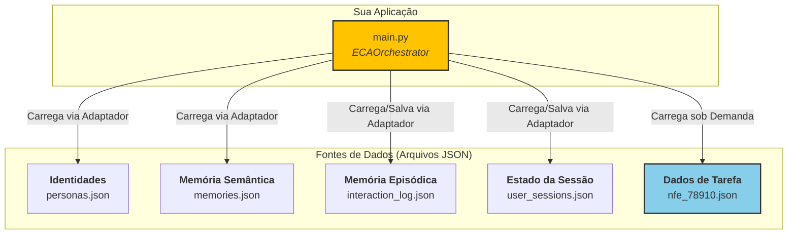

# Exemplo de Uso Autocontido da `eca-lib`

Este repositório contém uma implementação mínima e autocontida para demonstrar os principais recursos da **Engenharia de Contexto Aumentada (ECA)** utilizando a biblioteca `eca-lib`.

O objetivo é fornecer um ponto de partida prático e fácil de executar, sem a necessidade de configurar bancos de dados ou outras dependências complexas. Toda a persistência de estado, identidade e memória é feita através de arquivos JSON locais.

## 🚀 O que este Exemplo Demonstra?

Ao executar este código, você verá em ação os principais pilares da arquitetura ECA:

  * **🧠 Orquestração Cognitiva:** Como o `ECAOrchestrator` gerencia o fluxo da conversa.
  * **💾 Memória Híbrida:** A utilização de uma **Memória Semântica** (regras de negócio em `memories.json`) e uma **Memória Episódica** (histórico da conversa em `interaction_log.json`).
  * **🎭 Troca de Contexto:** A capacidade do sistema de alternar entre diferentes "domínios" ou "personas" (`CATÁLOGO` e `ÁBACO`) de forma fluida.
  * **📄 Injeção de Dados de Tarefa:** Como o sistema carrega um arquivo de dados externo (`nfe_78910.json`) quando a conversa o exige, injetando-o no prompt.
  * **🔌 Padrão de Adaptadores:** O uso dos `JSONProvider`s, mostrando como a lógica central é desacoplada das fontes de dados.

## ⚙️ Arquitetura do Exemplo

O diagrama abaixo ilustra como os componentes deste projeto se conectam:



## 🛠️ Como Executar

Siga os passos abaixo para ver a mágica acontecer.

### 1\. Pré-requisitos

  * Python 3.10 ou superior.

### 2\. Clone o Repositório

```bash
git clone https://github.com/coagentis/eca-lib-self-contained-example.git
cd eca-lib-self-contained-example
```

### 3\. Crie um Ambiente Virtual e Ative-o

```bash
# Crie o ambiente
python -m venv venv

# Ative o ambiente
# No Linux ou macOS:
source venv/bin/activate
# No Windows:
venv\Scripts\activate
```

### 4\. Instale as Dependências

Este projeto tem apenas uma dependência: a `eca-lib`.

```bash
pip install --index-url https://test.pypi.org/simple/ --no-deps eca-lib
```

### 5\. Execute o Script Principal

```bash
python main.py
```

## 📄 Saída Esperada

A saída no seu terminal mostrará **3 turnos** de uma conversa simulada com a usuária "Ana Paula". Observe atentamente o conteúdo da tag `[BEGIN_CONTEXT]` em cada turno:

  * **No Turno 1:** A identidade `[IDENTITY:CATÁLOGO|PRODUCT_CATALOG]` será carregada, junto com a memória semântica sobre o "último código de notebook".

  * **No Turno 2:** A identidade mudará para `[IDENTITY:ÁBACO|FISCAL]`. Mais importante, você verá a tag `[INPUT_DATA:...]` contendo todo o JSON da nota fiscal `nfe_78910.json`, demonstrando a injeção de dados de tarefa.

  * **No Turno 3:** A identidade retornará para `[IDENTITY:CATÁLOGO|PRODUCT_CATALOG]`, e a tag `[RECENT_HISTORY:...]` aparecerá, provando que o sistema lembrou do contexto anterior daquele domínio específico.

## 📚 Para Saber Mais

  * **Explore a Biblioteca:** Visite o repositório oficial da **[eca-lib no GitHub](https://www.google.com/search?q=https://github.com/coagentis/eca-lib)** para entender todos os seus componentes. Não se esqueça de deixar sua estrelinha (⭐)\!
  * **Aprofunde-se na Arquitetura:** Para um mergulho teórico, leia nosso **[Whitepaper de Arquitetura](https://www.google.com/search?q=LINK_PARA_SEU_WHITEPAPER)**.
  * **Conecte-se:** Siga o criador do projeto no **[LinkedIn](https://www.google.com/search?q=SEU_LINK_DO_LINKEDIN)**.